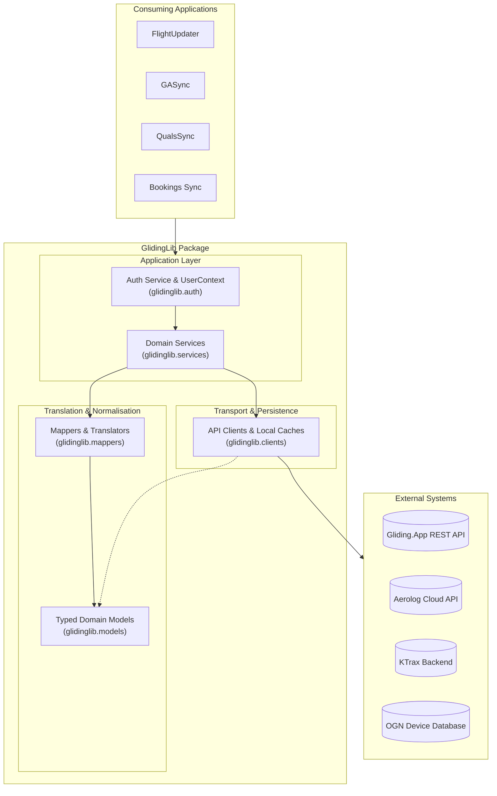

# GlidingLib

**GlidingLib** is a shared Python domain and integration library designed for the Cambridge Gliding Club (CGC) software ecosystem (powering applications such as `FlightUpdater`, `GASync`, `QualsSync`, and `Bookings Sync`).

It provides a unified domain model, type-safe API clients, Dutch-to-English translation mappers, role-based access control (RBAC), and high-level services to interact with:
1. **Gliding.App (`admin.zweef.app`)**: Club flight logging, member management, competencies, and recency tracking.
2. **Aerolog Cloud API (`DataModus`)**: Club accounting, membership ledgers, and billing imports.
3. **KTrax / OGN**: Live tracking radar sorties and Open Glider Network Device Database (DDB) lookups.

---

## 1. Overall Architecture

GlidingLib follows a layered architecture that isolates raw HTTP transport and vendor-specific schemas from consuming applications:



---

## 2. Directory Structure

```
glidinglib/
├── pyproject.toml              # Poetry build configuration (v1.1.5)
├── config_template.json        # Template configuration file
├── harness/                    # Test harness scripts and unit tests
│   ├── test_auth_service.py
│   ├── test_recency_unit.py
│   ├── test_combination_flights.py
│   ├── test_ga_accounts.py
│   ├── test_ga_flights.py
│   ├── test_user_recency.py
│   └── ...
└── src/
    └── glidinglib/
        ├── __init__.py         # Top-level exports and version
        ├── auth/               # RBAC, UserContext, and FastAPI helpers
        │   ├── auth_service.py
        │   ├── user_context.py
        │   └── fastapi_helpers.py
        ├── clients/            # Low-level HTTP sessions and API transports
        │   ├── glidingapp_client.py
        │   ├── aerolog_client.py
        │   ├── ktrax_flight_client.py
        │   ├── ogn_ddb_client.py
        │   └── aerolog_aircraft_client.py
        ├── mappers/            # Schema translation and normalisation
        │   ├── glidingapp_flight_mapper.py
        │   ├── glidingapp_flight_write_mapper.py
        │   ├── glidingapp_account_mapper.py
        │   ├── glidingapp_recency_mapper.py
        │   ├── glidingapp_combination_flight_mapper.py
        │   ├── aerolog_flight_mapper.py
        │   ├── aerolog_combination_flight_mapper.py
        │   ├── ktrax_flight_mapper.py
        │   └── ktrax_combination_flight_mapper.py
        ├── models/             # Dataclass domain entities
        │   ├── combination_flight_model.py
        │   ├── glidingapp_flight_model.py
        │   ├── glidingapp_account_model.py
        │   ├── glidingapp_recency_model.py
        │   ├── aerolog_flight_model.py
        │   ├── ktrax_flight_model.py
        │   └── aerolog_tech_qualification.py
        ├── services/           # High-level business operations
        │   ├── glidingapp_flight_service.py
        │   ├── glidingapp_account_service.py
        │   ├── glidingapp_aircraft_service.py
        │   ├── aerolog_flight_service.py
        │   └── ktrax_flight_service.py
        └── utils/              # OS path resolution and helpers
            └── app_paths.py
```

---

## 3. Core Modules & How They Work

### A. Domain Models (`glidinglib.models`)
All domain entities are defined as Python `@dataclass` classes with sensible defaults and date/time conversions:

1. **`CombinationFlight`**: The canonical flight model. Represents a completed sortie by combining the glider flight with its associated tug flight into a single record. This solves aerotow matching across Gliding.App, KTrax, and Aerolog.
2. **`GlidingAppFlight`**: Native Gliding.App flight model including launch heights (metres and feet), engine run times, crew IDs, and change histories.
3. **`GlidingAppAccount`**: Member account profile containing medical dates, instructor ratings (BIS, FIS, FES), license numbers, and assigned groups.
4. **`GlidingAppUserRecency` & `GlidingAppRecencyDetail`**: Pilot currency and 24-month recency breakdown (winch, aerotow, self-launch, TMG starts, hours, 6-month launch methods, validity expiries).
5. **`AerologFlight`**: Aerolog flight ledger record with sync keys, billing accounts, voucher serials, and cost-share allocations.
6. **`KtraxFlight`**: KTrax radar sortie record with FLARM/ICAO IDs, raw callsigns, and calculated launch altitudes.

---

### B. Clients Layer (`glidinglib.clients`)
Handles HTTP requests, session pooling, authentication headers, error retries, and local filesystem caches:

* **`GlidingAppClient`**:
  - Connects to Gliding.App REST API with `X-API-KEY` and custom `User-Agent`.
  - Supports fetching/updating flights, member accounts, fleet records, competencies, and member recency.
* **`AerologClient`**:
  - Connects to Aerolog Cloud API via JWT Bearer token authentication.
  - Automatically handles login and token renewal on HTTP 401 Unauthorized responses.
  - Provides methods for flight log retrieval, 3rd-party batch flight imports (`ImportFlightLogsFrom3ps`), and member technical qualifications.
  - Implements numerical range filtering on qualifications to overcome Aerolog API SQL string/lexicographical comparison quirks.
* **`KtraxFlightClient`**:
  - Fetches JSON logbooks from `https://ktrax.kisstech.ch/backend/logbook`.
  - Automatically calculates UK Daylight Saving timezone offsets (`0` for GMT, `1` for BST) for the queried date.
* **`OgnDdbClient`**:
  - Downloads and caches the Open Glider Network Device Database (DDB) to `%LOCALAPPDATA%` / `~/.glidinglib`.
  - Builds indexed in-memory dictionaries for instant lookup by `device_id`, normalized `registration`, `competition number (cn)`, and `aircraft_model`.
* **`AerologAircraftClient`**:
  - Loads and parses Aerolog fleet Excel downloads (`.xlsx`) using `openpyxl` table parsing and caches records in JSON format.

---

### C. Mappers Layer (`glidinglib.mappers`)
Isolates external vendor API naming conventions and handles Dutch-to-English domain translation:

* **Terminology Translation**:
  - Launch methods: `lier` &rarr; `winch`, `sleep` &rarr; `aerotow`, `zelf` / `zelfstart` &rarr; `self-launch`, `tmg` &rarr; `tmg`.
  - User groups: `zweefvlieger` &rarr; `glider pilot`, `startleider` &rarr; `launch director`, `instructeur` &rarr; `instructor`, `sleepvlieger` &rarr; `tow pilot`, `bestuur` &rarr; `committee`.
  - Recency status: `groen` &rarr; `green`, `oranje` &rarr; `amber`, `rood` &rarr; `red`.
* **Combination Mapping**:
  - `map_glidingapp_day_to_combination_flights`: Links glider flights to their tow plane flight via `sleep_uuid` / `tow_flight_uuid` and excludes raw tug sorties from the primary list.
* **Payment & Cost Allocation**:
  - `_payment_fields`: Automatically resolves billing splits for Aerolog (e.g. `trial flight` &rarr; account `1002`, `city uni` &rarr; `1225`, `scouts` &rarr; `1099`, `splitcost` &rarr; 50/50, P2 payer &rarr; 0/100, PIC &rarr; 100/0).
* **Write Payloads**:
  - `map_glidingapp_flight_to_write_payload`: Re-serializes modified flight objects into the complete payload required by GA's `PUT /api/flights.json`.

---

### D. Services Layer (`glidinglib.services`)
Provides business operations, environment routing, caching, and dry-run safety:

* **Multi-Environment Routing**:
  Services accept `data_source="live" | "test" | "config"`, allowing seamless switching between production and test/sandbox instances without changing code.
* **`GlidingAppAccountService`**:
  - Manages member accounts with an in-memory TTL cache (default 300s).
  - Queries active members, group members, email lookups, and member currency/recency (`get_user_recency`).
* **`GlidingAppFlightService`**:
  - Retrieves flights by date, year, or update timestamp.
  - Supports dry-run batch flight updates (`dry_run=True`) and granular per-flight error tracking (`status: "ok" | "partial" | "error"`).
* **`AerologFlightService`**:
  - Submits flight logs to Aerolog and runs read-back verification against uploaded `SyncKey` values to detect missing or unposted records.

---

### E. Auth & Security Framework (`glidinglib.auth`)
Provides authentication resolution and Role-Based Access Control (RBAC):

* **`GlidingAppAuthService`**:
  - Reads role hierarchies and capabilities defined in `config.json`.
  - Evaluates user membership groups with recursive role alias expansion (e.g. `duty_officer` &rarr; `instructor`, `launch director`, `admin`).
* **`UserContext`**:
  - Encapsulates user permissions with clean querying methods:
    - `ctx.can("can_edit_flights")`
    - `ctx.can_access_page("flight_editor")`
    - `ctx.has_group("glider pilot")`
    - `ctx.to_dict()` for frontend `/api/auth/me` endpoints.
* **`fastapi_helpers`**:
  - Extracts authenticated emails from reverse-proxy headers (such as Cloudflare Access `Cf-Access-Authenticated-User-Email` or `X-User-Email`).
  - Provides local development fallbacks when running on `localhost`.
  - Supplies `create_user_dependency(auth_service)` for FastAPI endpoint dependency injection (`Depends(...)`).

---

## 4. Configuration (`config.json`)

GlidingLib applications use a structured `config.json` (see [`config_template.json`](./config_template.json)):

```json
{
  "glidingapp": {
    "server": "https://admin.zweef.app/club/cgc",
    "api_key": "YOUR_API_KEY",
    "test_server": "https://admin.zweef.app/club/cgc2",
    "test_api_key": "YOUR_TEST_API_KEY",
    "data_source": "live"
  },
  "aerolog": {
    "base_url": "https://www.datamodusaerolog.co.uk/alc_api",
    "email": "AerologCloudAPI_CGC",
    "password": "YOUR_PASSWORD",
    "test_base_url": "https://www.datamodusaerolog.co.uk/alc_api",
    "test_email": "AerologCloudAPI_CGC",
    "test_password": "YOUR_TEST_PASSWORD",
    "data_source": "live"
  },
  "permissions": {
    "roles": {
      "admin": ["admin", "committee", "bestuur"],
      "duty_officer": ["instructor", "instructeur", "launch director", "startleider", "admin"]
    },
    "pages": {
      "dashboard": ["*"],
      "flight_editor": ["duty_officer"],
      "aerolog_upload": ["instructor", "admin"]
    },
    "capabilities": {
      "can_view_logs": ["*"],
      "can_edit_flights": ["duty_officer"],
      "can_upload_aerolog": ["instructor", "admin"]
    }
  }
}
```

---

## 5. Usage Examples

### Fetching Combined Flights for a Day
```python
from datetime import date
from glidinglib import GlidingAppFlightService, map_glidingapp_flights_to_combination_flights

config = {...}  # Loaded from config.json
service = GlidingAppFlightService(config)

flights = service.get_flights_for_date(date(2026, 8, 23))
combined = map_glidingapp_flights_to_combination_flights(flights)

for flight in combined:
    print(f"Glider: {flight.registration} ({flight.callsign}) | Pilot: {flight.pic_name} | Launch: {flight.launch_method}")
    if flight.is_aerotow():
        print(f"  -> Tow Plane: {flight.tow_registration} | Height: {flight.tow_release_height_ft} ft")
```

### Checking Member Currency & Recency
```python
from glidinglib import GlidingAppAccountService

service = GlidingAppAccountService(config)
recency = service.get_user_recency(user_id=71)

print(f"User Currency: {recency.currency_status}") # 'green', 'amber', 'red'
print(f"Aerotow Launches (24m): {recency.recency.aerotow_starts}")
print(f"Aerotow Valid Until: {recency.recency.aerotow_valid_to}")
for m in recency.recency.six_month_methods:
    print(f"Last 6m {m.launch_method}: {m.starts} starts")
```

### FastAPI Authentication Dependency
```python
from fastapi import FastAPI, Depends
from glidinglib import GlidingAppAuthService, UserContext, create_user_dependency

app = FastAPI()
auth_service = GlidingAppAuthService(config)
get_current_user = create_user_dependency(auth_service)

@app.get("/api/flights")
def get_flights(user: UserContext = Depends(get_current_user)):
    if not user.can("can_view_logs"):
        raise HTTPException(status_code=403, detail="Forbidden")
    return {"user": user.name, "membership": user.membership_number}
```

---

## 6. Development & Testing

### Running Tests
GlidingLib uses Poetry and Python's standard `unittest` framework:

```bash
# Run all unit tests in the harness directory
poetry run python -m unittest discover harness
```

### Running Test Harness Scripts
Interactive verification scripts are provided in `harness/`:

```bash
# Fetch and print combination flights for a date
poetry run python harness/test_combination_flights.py 2026-08-23 --data-source live

# Query pilot recency
poetry run python harness/test_user_recency.py 71

# Query Gliding.App members
poetry run python harness/test_ga_accounts.py
```
